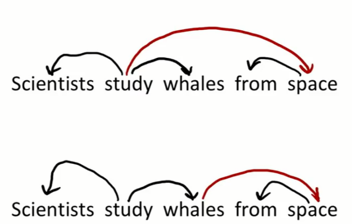
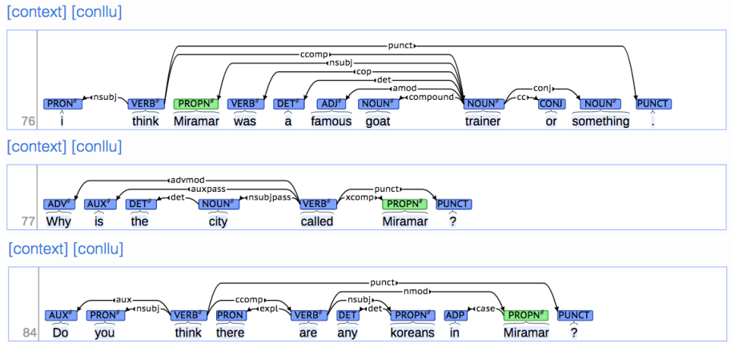
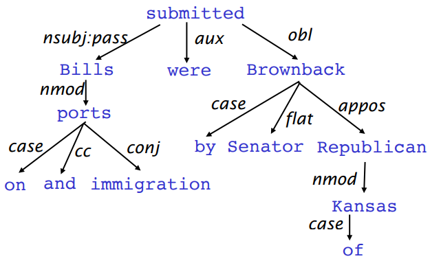
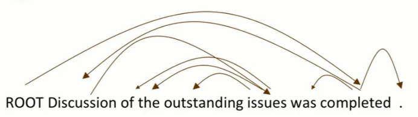
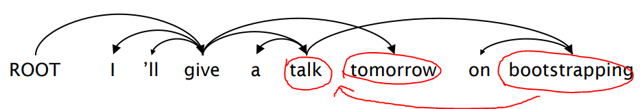

# Dependency Parsing

----

## Two views of linguistic structure : 

## 1. Constituency = Pharse Structure Grammar = Context-Free Grammars(CFGs)

&nbsp;&nbsp;&nbsp;&nbsp;&nbsp;&nbsp;&nbsp;&nbsp;&nbsp;&nbsp;&nbsp;&nbsp;the&nbsp;&nbsp;&nbsp;&nbsp;&nbsp;&nbsp;&nbsp;&nbsp;&nbsp;&nbsp;cat 
&nbsp;&nbsp;&nbsp;&nbsp;&nbsp;&nbsp;&nbsp;&nbsp;&nbsp;&nbsp;&nbsp;&nbsp;a&nbsp;&nbsp;&nbsp;&nbsp;&nbsp;&nbsp;&nbsp;&nbsp;&nbsp;&nbsp;&nbsp;&nbsp;&nbsp;dog 
&nbsp;&nbsp;&nbsp;&nbsp;&nbsp;&nbsp;&nbsp;&nbsp;&nbsp;&nbsp;&nbsp;&nbsp;&nbsp;&nbsp;&nbsp;&nbsp;&nbsp;large&nbsp;&nbsp;&nbsp;&nbsp;&nbsp;&nbsp;&nbsp;&nbsp;&nbsp;&nbsp;&nbsp;in a create 
&nbsp;&nbsp;&nbsp;&nbsp;&nbsp;&nbsp;&nbsp;&nbsp;&nbsp;&nbsp;&nbsp;&nbsp;&nbsp;&nbsp;&nbsp;&nbsp;&nbsp;barking&nbsp;&nbsp;&nbsp;&nbsp;&nbsp;&nbsp;&nbsp;on the table 
&nbsp;&nbsp;&nbsp;&nbsp;&nbsp;&nbsp;&nbsp;&nbsp;&nbsp;&nbsp;&nbsp;&nbsp;&nbsp;&nbsp;&nbsp;&nbsp;&nbsp;cuddly&nbsp;&nbsp;&nbsp;&nbsp;&nbsp; &nbsp;&nbsp;&nbsp;by the door 
&nbsp;&nbsp;&nbsp;&nbsp;&nbsp;&nbsp;&nbsp;&nbsp;&nbsp;&nbsp;&nbsp;&nbsp;&nbsp;&nbsp;large barking 
talk to 
look for

문장은 Grammar의 구조에 따라 이루워져 있으며(Pharse Structure Grammar), 이에 따라 구조화가 가능하다. 
즉, 몇가지로 정의된 단어의 종류가 있으며 모든 문장은 해당 종류의 조합으로 표현 가능하다.(Context-Free 하게) 
이는 언어학자들이 인간 언어의 구조를 설명하기 위해 만들어낸 방법론 이다.

1. NP --> Determiner(이하 Det) N
2. NP --> Det (A) N (PP)
3. NP --> Det A\* N PP\*
4. PP --> P N P
5. VP --> V PP

문장 구조는 언어마다 조금씩 다르며 고정된 형식을 따르지 않는다.
 위의 예시 처럼 다양한 형식의 문장이 존재 가능하며, 더욱 복잡하게도 가능하다
 또한 만들어진 결과는 특정 언어(주로 미국 공용어)에 종속성이 맞춰진 방법론 이 된다.

## 2. Dependency Structure

문장의 구조를 파악하는 대신, 각 단어간의 관계를 통해 의존성을 가지고 만들어낸 구조를 Dependency Structure라 한다.

의존(Dependency)은 어떤 단어가 다른 단어를 수식 하거나, 다른 단어의 일부분이 되는 경우 이다. 
barking dog 에서 barking은 dog를 수식하므로, barking은 dog에 의존(Dependency)한다고 한다.

## 3. Ambiguity : PP attachments

하지만, 이 때 모호함이 생기는데, 이는 위와 같이 두가지 해석이 가능한 경우이다. 
위의 경우

1. 과학자들은 우주에서 고래를 연구하고 있다.
2. 과학자들은 우주에서 온 고래를 연구하고 있다.

의 두가지로 해석이 가능하다.

이는 그림에서와 같이, space가 수식하는 대상이 Study인지 Whales인지에 따라 달라지며, 해석과 Dependency Sturuct 분석에 혼란을 야기한다.

이를 위해, 문법적 구조를 통해 의존성을 알아보려 할 경우 대부분의 경우에는 Ambiguity 문제가 해결 되지만, 전치사구의 경우 명사구와 동사 둘 다 수식 가능하므로 문제가 여전히 지속된다.

따라서, 문장에서 전치사구의 갯수를 기준으로 하여 exponential하게 늘어날 것 이며, 통계학자들은 이를 위해 Catalan numbers를 붙여 사용한다.

([Catalan numbers](https://ko.wikipedia.org/wiki/카탈랑_수) 는 이진트리의 수 등을 셀 때 사용하는 Exponetial Seris) 

## 4. The rise of annotated data : Treebanks

이를 위한 해결책으로, Treebanks라는 방법이 제안되어었다.

Treebanks는 문법에 대한 의존성 없이, 구문을 분석하기 위한 방법론 이다. 하지만, 이는 매우 느린 속력을 보이며 아주 비효율적이다. 
(즉, Grammar를 이용하는 아이디어는 각 단어를 정해진 몇 종류로 나누기 때문에 매우 효율적인 분석을 할 수 있는 아이디어 이다.)

하지만, 현대의 머신러닝의 기법과 함께 하면서 Treebank는 말이 되는 방법론으로 변화하였다. 

#### 재사용성
사람들은 문장을 적을 때, 일종의 경향성을 가지고 있으며, 이에 따라 한 번 만들어진 Treebank는 다른 문장에 재적용 가능하다.
또한, 많은 파서또는 part-of-speech taggers 등을 적용 가능하며, 언어학자들에게 가치있는 도구로 작용 가능하다.
#### 광범위한 적용 범위
이는 특정 몇가지 만을 위한 데이터가 아닌, 광범위 하게 적용 가능한 데이터를 만들어낸다.
#### 주기 및 분포에 대한 정보
단어들에 대한 주기 및 분포에 대한 정보를 알 수 있다.
#### 시스템 평가
시스템을 평가 가능하다.

## 5. Dependency Grammar and Dependency Strurcre

종속성 구문은 구문 구조가 어휘 항목 간의 관계, 일반적으로 종속성이라고하는 이진 비대칭 관계 ( "화살표")로 구성되어 있다고 가정한다.

이 아이디어는 앞서 말한 Treebank에서의 이야기와 다르게 느껴질 수 있으나, 현대까지 이어오는 자연어 처리의 역사에서, 결국 문법 구조를 사용하는 아이디어를 채용했음을 확인 가능하다.

그 중 80%이상의 논문이 의존성 표현을 사용하고 있다.

Dependency Grammar의 아이디어는 (기존 CFGs와 비교해서) 화살표에 따른 종속성을 가지고 의존성을 베이스로 한 분석을 하는 것 이다. 
이후에 우리는 각 특징적인 구조에 이름을 붙여서 처리 가능하다.

즉, lexcial items 사이의 이진적이며, 불균형적인 의존성 관계를 찾아내며, 이를 화살표로 표현한다. 화살표 들이 의존성(dependency)를 의미하며, 문법적 특징에 따라 분류한다.

화살표의 시작에 있는 단어를 head, 끝에 있는 단어를 dependent라고 정의하도록 한다. Dependent는 head의 argument이다.

이는 특정 언어에 종속적인 문법 구조를 통한 분석이 아닌, Universal dependencies분석이며, 즉 이는 새로훈 treebanks 이다.

전치사의 정의가 특징적인데, 일반적으로 전치사는 목적어를 가지지만, 여기서 전치사는 dependent를 가지고 있지 않으며 문장에서 명사의 역할을 보여주는 용도로 사용된다.

Dependency Grammar는 Tree구조를 가지기 때문에 Graph이론에서 말하는 특성을 지닌다. 즉, 하나의 Head아래에 여러 Leep node가 존재 하고 있다는 것 이다.

많은 경우, 분석의 편의성을 위해, 가상의 Root를 만들어 문장의 Root가 되도록 한다. 이는 문장 내에서 아무런 Dependency를 가지지 않는 단어가 있을 수 있기 때문이며, 해당 단어는 문장 전체의 head가 되게 된다.

우리는 어떤 단어가 다른 단어에 의존하는지를 정의하는 방식을 고민해 보아야 한다. 이를 위해 4가지 방법을 제안 하였다.

1. Bilexicla affinities
     단어간 관계를(distribution word representation) 통해 유사한 단어 끼리 의존성을 평가
2. Dependency distance
     단어간 거리를 통해 의존성을 평가(관련 있는 단어는 주로 붙어있음)
3. Intervening material
     구두점을 통한 의존성 평가(관련 있는 단어는 구두점을 통해 떨어져 있지 않음)
4. Valency of heads
     문장의 head의 문법 구조 분석을 통한 평가(단어 별 필수 문장 성분에 따름)

## 6. Dependency Parsing

각 문장은 어느 단어가 다른 어느 단어에 의존성을 가지는지에 따라 파싱된다.(Root포함) ROOT는 단 하나의 단어만을 Dependent로 가지며, Cycle구조는 허용되지 않는다. 

만약, 해당 tree가 fully-nesting 한 구조를 가진다면, 이를 projective dependency tree라고 부르도록 한다. 이는 평면에 표현 가능하며, nesting relationship을 가진다.

위의 그림과 같은 경우, Bootstrapping 이란 단어가 맨 뒤로 옮겨짐에 따라, nesting 한 구조에서 cross가 생겨 버리게 되었다. 이런 경우에도 허용은 하지만, (bootstrapping 은 여전히 talk를 수식) 이런 경우에는 non-projective dependency tree 라고 부르도록 한다.

